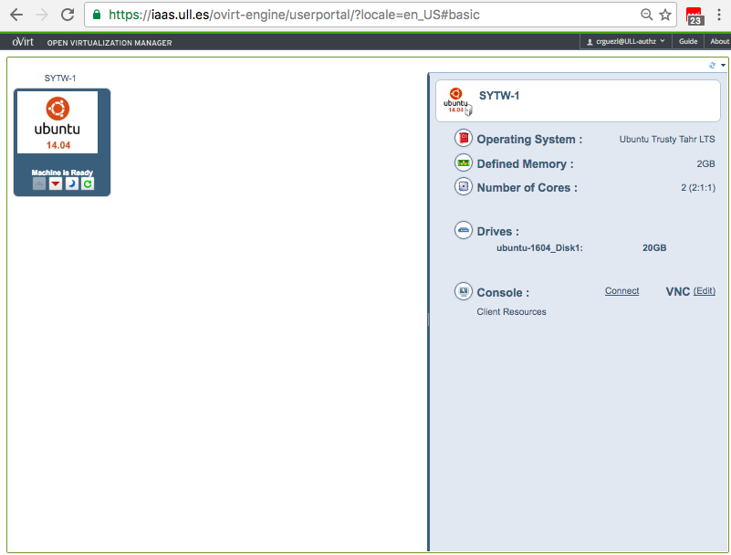
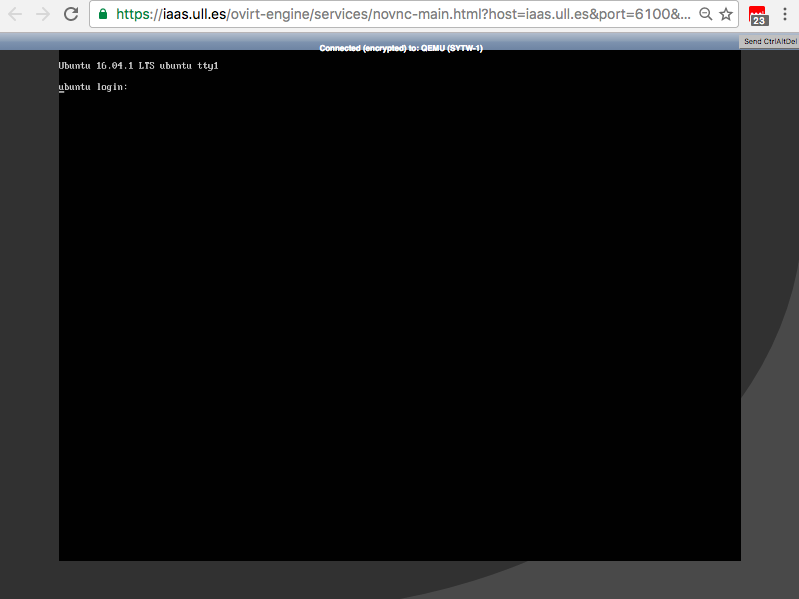

# Como Desplegar una Aplicación Web en [iaas.ull.es](https://iaas.ull.es)

Para acceder al servicio, todos los usuarios (tanto los responsables como los usuarios
finales) accederán a [https://iaas.ull.es](https://iaas.ull.es), donde seleccionarán la opción **Portal del usuario**.

Recuerde que dentro de la ULL deberá haber **entrado previamente a [https://acceso.ull.es](https://acceso.ull.es)**, esto es estar autenticado como miembro de la ULL  y desde fuera de la ULL usando la VPN de la ULL

### 
### Una vez autenticado le saldrá el menú con su panel de máquinas:
### 
### Al pulsar sobre `connect` se abrirá una terminal en el navegador:
### 

## Averiguar la IP de la máquina virtual

* Averigue la IP de la máquina para poder usar `ssh`. En la terminal de su navegador conectado a la máquina escriba:

                usuario@SYTW:~/src/sytw$ ifconfig
                eth0      Link encaa:Ethernet  direcciónHW aa:aa:aa:aa:aa:aa  
                          Direc. inet:55.5.555.55


## Acceso por SSH y Credenciales

* Las credenciales son `usuario/usuario`, se les forzará a cambiar la contraseña ante el primer login.

* Las máquinas tienen IP dinámica por DHCP (en principio tienen keepalive así que no debería cambiarlas)

* Los usuarios tienen disponibilidad para hacer SSH a las máquinas,

    1. dentro de la ULL **entrando previamente a [https://acceso.ull.es](https://acceso.ull.es)** y
    2. desde fuera de la ULL usando la VPN


Serán requeridas las credenciales de la ULL; es decir, este servicio será exclusivo para la
comunidad universitaria

## VPN ULL

Tutorial sobre como usar el [Servicio VPN de la ULL](https://usuarios.ull.es/vpn/)


## Referencias

* Véase [este documento como HTML](https://sytw.github.io/iaas-ull-es/index.html)

* Véase este [repo en GitHub](https://github.com/SYTW/iaas-ull-es)

* Lea el documento ["Manual de administración de Pools de máquinas"](manualDeAdministracionDelPoolsDeMaquinas.pdf).

## Opciones de Consola

* Se han configurado con el visor VNC (recuerde poner la opción `noVNC` en las
opciones de la cónsola)


## Puertos abiertos en las Máquinas Virtuales

* Creo que ahora mismo están abiertos los puertos:
  -  22, 80, 443 y
  - el rango del 8080 al 8090

## Descripción de las máquinas

* En principio se dispone de una máquina por alumno
* Las máquinas de una misma asignatura comparten el mismo *tag*, por ejemplo  `SISTECWEB` o algo parecido
* Las máquinas tienen 2GB de RAM y 1 procesador de 2 CPUs cada una

### Que suele estar instalado

Lo que está instalado en las máquinas depende del tipo de plantilla
que haya solicitado el profesor para el curso.
De todos modos, como tenemos permisos de administración no es mucho problema instalar cualquier software que nos falte.

Lo que sigue es la descripción de una máquina típica correspondiente
a una plantilla *de servidor*.


* Está instalado `git`, una versión de `node`

                  usuario@SYTW:~$ git --version
                  git version 1.9.1

Si queremos actualizar `git`:
```sh
apt-get install git
```

* Está instalado `nodejs`. Recuerde que es Linux Ubuntu: `node` no es  `nodejs`:

            usuario@SYTW:~$ node --version
            El programa «node» puede encontrarse en los siguientes paquetes:
             * node
             * nodejs-legacy
            Intente: sudo apt-get install <paquete seleccionado>

            usuario@SYTW:~$ nodejs --version
            v0.10.25

* y está instalada una versión vieja de `ruby`.

                usuario@SYTW:~$ ruby --version
                ruby 1.9.3p484 (2013-11-22 revision 43786) [x86_64-linux]

* Tampoco `rvm`:

                  usuario@SYTW:~$ rvm --version
                  No se ha encontrado la orden «rvm» pero hay 20 similares

* No está nada más.

                  usuario@SYTW:~$ nvm --version
                  No se ha encontrado la orden «nvm»

* Tampoco está `npm`:

                    usuario@SYTW:~$ npm --version
                    El programa «npm» no está instalado. Puede instalarlo escribiendo:
                    sudo apt-get install npm

* instale `npm` y si lo desea `nvm`

## Instalar `npm`

* Instale `npm` si no está instalada

              usuario@SYTW:~/src/sytw/express-start/hello$ sudo apt-get install npm

o mejor aún use `nvm`

## Configure el cliente ssh para trabajar con GitHub

* Recuerde poner sus claves privadas de GitHub en `.ssh` para poder trabajar con sus repos

* Actualice `~/.ssh/config` de manera apropiada:

            usuario@SYTW:~/src/sytw$ cat ~/.ssh/config
            Host github.com
            HostName github.com
            user git
            IdentityFile /home/usuario/.ssh/miclaveparagithub

## Descargando un repo

* Cree un directorio de trabajo:

          usuario@SYTW:~$ mkdir src
          usuario@SYTW:~$ cd src
          usuario@SYTW:~/src$ mkdir sytw
          usuario@SYTW:~/src$ cd sytw/

* Clone un repo con una aplicación Web de prueba. Por ejemplo [crguezl/express-start](https://github.com/crguezl/express-start):

          usuario@SYTW:~/src/sytw$ git clone git@github.com:crguezl/express-start.git
          Clonar en «express-start»...
          Warning: Permanently added the RSA host key for IP address '555.55.555.555'
                   to the list of known hosts.
          remote: Counting objects: 87, done.
          remote: Total 87 (delta 0), reused 0 (delta 0), pack-reused 87
          Receiving objects: 100% (87/87), 66.93 KiB | 0 bytes/s, done.
          Resolving deltas: 100% (41/41), done.
          Checking connectivity... hecho.

* Este es el contenido de la aplicación de ejemplo [hello.js](https://github.com/crguezl/express-start/blob/master/hello/hello.js):

            usuario@SYTW:~/src/sytw/express-start$ cd hello/

            usuario@SYTW:~/src/sytw/express-start/hello$ vi hello.js
            usuario@SYTW:~/src/sytw/express-start/hello$ # cambiamos port de escucha a 80

            usuario@SYTW:~/src/sytw/express-start/hello$ cat hello.js
```javascript
            var express = require('express')
            var app = express()
            var path = require('path');

            // view engine setup
            app.set('views', path.join(__dirname, 'views'));
            app.set('view engine', 'ejs');

            app.get('/', function (req, res) {
              //res.send('Hello World!')
              res.render('index', { title: 'Express' });
            })

            app.get('/chuchu', function (req, res) {
              //res.send('Hello Chuchu!')
              res.render('index', { title: 'Chuchu' });
            })

            var server = app.listen(80, function () {

              var host = server.address().address
              var port = server.address().port

              console.log('Example app listening at http://%s:%s', host, port)

            })
```

## Instalando dependencias

* Instalamos las dependencias:

            usuario@SYTW:~/src/sytw/express-start/hello$ npm install
            npm WARN package.json hello@0.0.0 No description
            npm WARN package.json hello@0.0.0 No repository field.
            ...

## Ejecución de un servicio

* Ejecutamos:

            usuario@SYTW:~/src/sytw/express-start/hello$ sudo nodejs hello.js
            sudo: imposible resolver el anfitrión SYTW
            Example app listening at http://0.0.0.0:80

* Visitamos la página con el navegador usando la URL con la IP:


