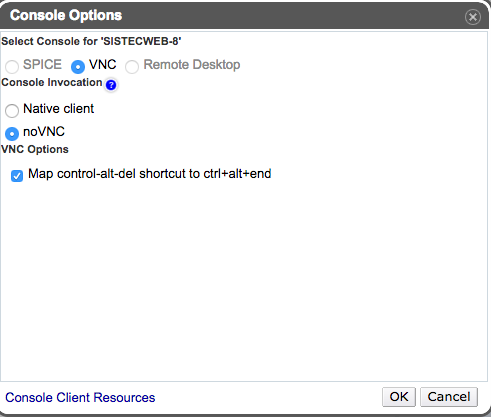

# Como Desplegar una Aplicación Web en [iaas.ull.es](iaas.ull.es)

* Véase [este documento como HTML](https://sytw.github.io/iaas-ull-es/index.html)

* Véase el [repo en GitHub](https://github.com/SYTW/iaas-ull-es)

* Lea el documento ["Manual de administración de Pools de máquinas"](manualDeAdministracionDelPoolsDeMaquinas.pdf). 

* En principio se dispone de una máquina por alumno

* Se han configurado con el visor VNC (recuerde poner la opción `noVNC` en las 
opciones de la cónsola)

* Las máquinas comparten el "tag" `SISTECWEB` para identificarlas

* Las máquinas tienen 2GB de RAM y 1 procesador de 2 CPUs cada una 

* Está instalado `git`, una versión de `node` 

                  usuario@SYTW:~$ git --version
                  git version 1.9.1

* Está instalado `nodejs`. Recuerde que es Linux Ubuntu: `node` no es  `nodejs`:

            usuario@SYTW:~$ node --version
            El programa «node» puede encontrarse en los siguientes paquetes:
             * node
             * nodejs-legacy
            Intente: sudo apt-get install <paquete seleccionado>

            usuario@SYTW:~$ nodejs --version
            v0.10.25

* y está instalada una versión vieja de `ruby`. 

                usuario@SYTW:~$ ruby --version
                ruby 1.9.3p484 (2013-11-22 revision 43786) [x86_64-linux]

* Tampoco `rvm`:

                  usuario@SYTW:~$ rvm --version
                  No se ha encontrado la orden «rvm» pero hay 20 similares

* No está nada más. 

                  usuario@SYTW:~$ nvm --version
                  No se ha encontrado la orden «nvm»

* Tampoco está `npm`:

                    usuario@SYTW:~$ npm --version
                    El programa «npm» no está instalado. Puede instalarlo escribiendo:
                    sudo apt-get install npm

* instale `npm` y si lo desea `nvm`

* Las credenciales son `usuario/usuario`, se les forzará a cambiar la contraseña ante el primer login. 

* Las máquinas tienen IP dinámica por DHCP (en principio tienen keepalive así que no debería cambiarlas)

* Los usuarios tienen disponibilidad para hacer SSH a las máquinas, 

    1. dentro de la ULL entrando previamente a [https://acceso.ull.es](https://acceso.ull.es) y 
    2. desde fuera usando la VPN 

## VPN ULL

[Servicio VPN de la ULL](https://usuarios.ull.es/vpn/)

## Poniendo a Funcionar una Aplicación Web NodeJS

* Averigue la IP de la máquina para poder usar `ssh`

                usuario@SYTW:~/src/sytw$ ifconfig
                eth0      Link encaa:Ethernet  direcciónHW aa:aa:aa:aa:aa:aa  
                          Direc. inet:55.5.555.55 

* Instale `npm`

              usuario@SYTW:~/src/sytw/express-start/hello$ sudo apt-get install npm

o mejor aún use `nvm`

* Recuerde poner sus claves privadas de GitHub en `.ssh` para poder trabajar con sus repos

* Actualice `~/.ssh/config` de manera apropiada:

            usuario@SYTW:~/src/sytw$ cat ~/.ssh/config 
            Host github.com
            HostName github.com
            user git
            IdentityFile /home/usuario/.ssh/miclaveparagithub

* Cree un directorio de trabajo:

          usuario@SYTW:~$ mkdir src
          usuario@SYTW:~$ cd src
          usuario@SYTW:~/src$ mkdir sytw
          usuario@SYTW:~/src$ cd sytw/

* Clone un repo con una aplicación Web de prueba. Por ejemplo [crguezl/express-start](https://github.com/crguezl/express-start):

          usuario@SYTW:~/src/sytw$ git clone git@github.com:crguezl/express-start.git
          Clonar en «express-start»...
          Warning: Permanently added the RSA host key for IP address '555.55.555.555' 
                   to the list of known hosts.
          remote: Counting objects: 87, done.
          remote: Total 87 (delta 0), reused 0 (delta 0), pack-reused 87
          Receiving objects: 100% (87/87), 66.93 KiB | 0 bytes/s, done.
          Resolving deltas: 100% (41/41), done.
          Checking connectivity... hecho.

* Este es el contenido de la aplicación de ejemplo [hello.js](https://github.com/crguezl/express-start/blob/master/hello/hello.js):

            usuario@SYTW:~/src/sytw/express-start$ cd hello/

            usuario@SYTW:~/src/sytw/express-start/hello$ vi hello.js
            usuario@SYTW:~/src/sytw/express-start/hello$ # cambiamos port de escucha a 80

            usuario@SYTW:~/src/sytw/express-start/hello$ cat hello.js
            var express = require('express')
            var app = express()
            var path = require('path');

            // view engine setup
            app.set('views', path.join(__dirname, 'views'));
            app.set('view engine', 'ejs');

            app.get('/', function (req, res) {
              //res.send('Hello World!')
              res.render('index', { title: 'Express' });
            })

            app.get('/chuchu', function (req, res) {
              //res.send('Hello Chuchu!')
              res.render('index', { title: 'Chuchu' });
            })

            var server = app.listen(80, function () {

              var host = server.address().address
              var port = server.address().port

              console.log('Example app listening at http://%s:%s', host, port)

            })

* Instalamos las dependencias:

            usuario@SYTW:~/src/sytw/express-start/hello$ npm install
            npm WARN package.json hello@0.0.0 No description
            npm WARN package.json hello@0.0.0 No repository field.
            ...

* Ejecutamos:

            usuario@SYTW:~/src/sytw/express-start/hello$ sudo nodejs hello.js 
            sudo: imposible resolver el anfitrión SYTW
            Example app listening at http://0.0.0.0:80

* Visitamos la página con el navegador usando la URL con la IP:

